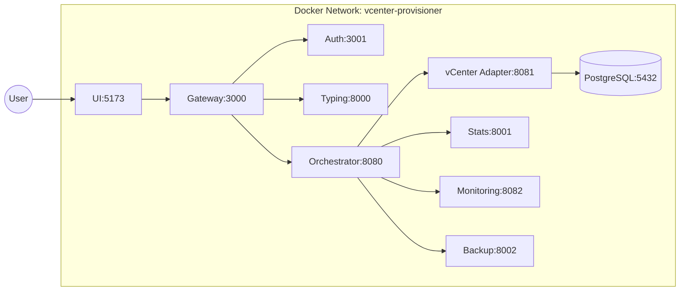
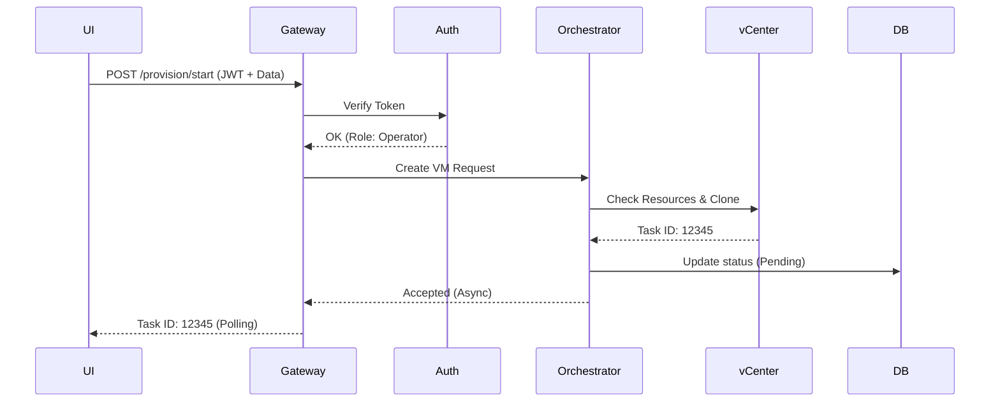
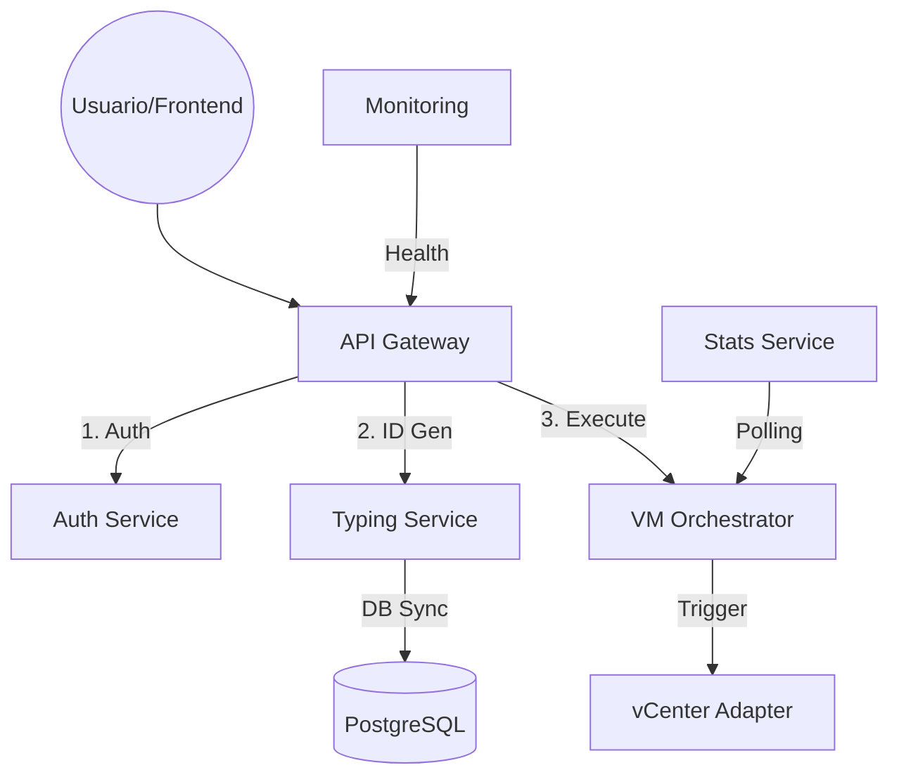

# Arquitectura: vCenter Provisioner 🏗️

> **Docker Compose es el target de producción.** Sin Kubernetes, Dapr ni abstracciones adicionales.

---

## 1. Stack de Microservicios Especializados

| Servicio | Puerto | Lenguaje | Stack | Descripción |
|----------|--------|----------|-------|-------------|
| **API Gateway** | 3000 | Node.js | Fastify | Punto de entrada, proxy, JWT verification |
| **Auth Service** | 3001 | Node.js | Fastify | Gestión de identidad y usuarios |
| **Typing Service** | 8000 | Python | FastAPI | Motor TP-Haki (nomenclatura dinámica) |
| **VM Orchestrator** | 8080 | Go | Gin | Máquina de estados y ejecución asíncrona |
| **vCenter Adapter** | 8081 | Go | Gin | Integración vSphere (MOCKED → READ-ONLY) |
| **Stats Service** | 8001 | Python | FastAPI | Métricas y analítica |
| **Monitoring** | 8082 | Go | Gin | Sentinel de salud y observabilidad |
| **Backup Service** | 8002 | Python | - | Gestión de respaldos |
| **Provisioner UI** | 5173 | React | Vite | Interfaz Staff Grade |

---

## 2. Racional Políglota

| Lenguaje | Uso | Justificación |
|----------|-----|---------------|
| **Go** | Orchestrator, vCenter Adapter, Monitoring | Concurrencia robusta, SDK nativo `govmomi` |
| **Python** | Typing, Stats, Backup | Workflows largos, modelos ML, desarrollo rápido |
| **Node.js** | Gateway, UI | I/O intensivo, ecosistema React |

---

## 3. Diagramas de Arquitectura

### Deployment - Docker Compose

### Flujo de Secuencia - Provisión de VM

---

## 4. Flujo de Datos

---

## 5. Contratos de Infraestructura

| Contrato | Descripción |
|----------|-------------|
| **Producción** | Solo `infra/local/docker-compose.yml` |
| **Imágenes** | Tags hash determinísticos, sin `:latest` |
| **Redes** | Docker network privada `vcenter-provisioner` |
| **Tests** | Híbridos: Host (velocidad) + Docker (determinismo) |

---

## 6. Recursos y Variables

### Límites de Memoria

| Servicio | Límite |
|----------|---------|
| API Gateway | 256Mi |
| Typing Service | 128Mi |
| VM Orchestrator | 64Mi |
| Database (PostgreSQL) | 512Mi |

### Variables Críticas

| Variable | Propósito |
|----------|-----------|
| `JWT_SECRET` | Firma de tokens |
| `DATABASE_URL` | Conexión PostgreSQL |
| `VCENTER_URL/VCENTER_USER` | Credenciales vCenter (Mocked) |

---

## 7. Integración vCenter

| Modo | Estado | Descripción |
|------|--------|-------------|
| **MOCKED** | Actual | Simula respuesta de vSphere |
| **READ-ONLY** | Pendiente | GET VMs, templates, datastores reales |

---

## 8. Documentación Relacionada

| Tema | Documento |
|------|-----------|
| Sistema de Monitoreo | [MONITORING-SYSTEM-DESIGN.md](./MONITORING-SYSTEM-DESIGN.md) |
| Base de Datos | [db-schema.md](./db-schema.md) |
| Motor TP-Haki | [TYPIFICATIONS.md](./TYPIFICATIONS.md) |
| CI/CD | [CI-CD-LOCAL.md](./CI-CD-LOCAL.md) |

---

© 2026 Antigravity Engineering | Architecture Reference
