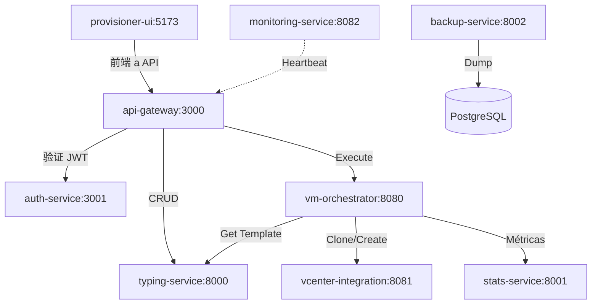

# Sistema de Monitoreo: Documentación de Diseño

## 1. Matriz de Conectividad (Basada en C4)

### Diagrama de Conexiones Reales



### Matriz de Probes por Servicio

| Servicio | Probea a (Conexiones Reales) | Probea a (Monitoring) | Intervalo |
|----------|-------------------------------|---------------------|-----------|
| **api-gateway** | auth-service, typing-service, orchestrator, vcenter, stats, backup | monitoring-service | 5s |
| **auth-service** | api-gateway, typing-service, orchestrator, vcenter, stats, backup | monitoring-service | 5s |
| **vm-orchestrator** | typing-service, vcenter, stats | monitoring-service | 5s |
| **typing-service** | api-gateway, orchestrator | monitoring-service | 20s (sample 3) |
| **vcenter-integration** | orchestrator, stats | monitoring-service | 20s (sample 3) |
| **stats-service** | api-gateway, orchestrator | monitoring-service | 20s (sample 3) |
| **backup-service** | db, orchestrator | monitoring-service | 20s (sample 3) |
| **provisioner-ui** | api-gateway, auth-service | monitoring-service | 20s (sample 3) |
| **monitoring-service** | api-gateway, auth-service, typing-service, orchestrator, vcenter, stats, backup, ui | - | 1s |

---

## 2. Endpoint de Configuración de Probes

Cada servicio debe exponer su configuración de probes:

```typescript
// GET /api/probe-config
interface ProbeConfig {
  service: string;
  interval_seconds: number;
  mode: 'full' | 'sample';
  sample_count: number;
  targets: string[];  // Lista de servicios a probe
  monitoring_url: string;
}

// Ejemplo response para typing-service:
{
  "service": "typing-service",
  "interval_seconds": 20,
  "mode": "sample",
  "sample_count": 3,
  "targets": ["api-gateway", "orchestrator"],
  "monitoring_url": "http://monitoring-service:8082"
}
```

---

## 3. Flujo de Datos de Probes

```
┌─────────────────────────────────────────────────────────────────┐
│                    FLUJO DE PROBES                              │
├─────────────────────────────────────────────────────────────────┤
│                                                                 │
│  probe-scheduler.sh                                             │
│  ┌─────────────────────────────────────────────────────────┐    │
│  │ 1. Lee configuración (variables de entorno)          │    │
│  │ 2. Obtiene lista de targets                           │    │
│  │ 3. Si mode=sample: selecciona N aleatorios           │    │
│  │ 4. Ejecuta curl /health a cada target                 │    │
│  │ 5. Envía resultado a monitoring-service               │    │
│  └─────────────────────────────────────────────────────────┘    │
│                              │                                  │
│                              ▼                                  │
│  monitoring-service (POST /api/probe-result)                   │
│  ┌─────────────────────────────────────────────────────────┐    │
│  │ 1. Guarda en Redis (TTL 60s)                          │    │
│  │ 2. Guarda en PostgreSQL (histórico)                   │    │
│  │ 3. Actualiza matriz de conectividad                   │    │
│  │ 4. Calcula métricas agregadas                         │    │
│  └─────────────────────────────────────────────────────────┘    │
│                              │                                  │
│                              ▼                                  │
│  provisioner-ui (/monitor)                                     │
│  ┌─────────────────────────────────────────────────────────┐    │
│  │ 1. Polling GET /api/services-status (60s)            │    │
│  │ 2. GET /api/connectivity-matrix                       │    │
│  │ 3. Visualiza diagrama + cards                        │    │
│  └─────────────────────────────────────────────────────────┘    │
│                                                                 │
└─────────────────────────────────────────────────────────────────┘
```

---

## 4. Cambios por Componente

### 4.1 probe-scheduler.sh (scripts/)

| Cambio | Descripción |
|--------|-------------|
| Parámetro `--mode` | `full` o `sample` |
| Parámetro `--sample-count` | N servicios a probe en modo sample |
| Parámetro `--targets` | Lista de servicios a probe (opcional) |
| Excluir self | No probeamos a nosotros mismos |
| Endpoint config | (Opcional) Lee configuración de `/api/probe-config` |

### 4.2 shared-scripts Image (scripts/Dockerfile)

```dockerfile
FROM alpine:3.19

RUN apk add --no-cache bash curl

COPY probe-scheduler.sh /probe-scheduler.sh
COPY shared-wrapper.sh /shared-wrapper.sh
COPY go-wrapper.sh /go-wrapper.sh
COPY nginx-wrapper.sh /nginx-wrapper.sh
COPY nginx-wrapper-simple.sh /nginx-wrapper-simple.sh

RUN chmod +x /probe-scheduler.sh /shared-wrapper.sh /go-wrapper.sh /nginx-wrapper.sh /nginx-wrapper-simple.sh

ENTRYPOINT ["/probe-scheduler.sh"]
```

### 4.4 go-wrapper.sh (scripts/)

```bash
#!/usr/bin/env bash

# Lee configuración de probes desde variables de entorno
PROBE_INTERVAL="${PROBE_INTERVAL:-5}"
PROBE_MODE="${PROBE_MODE:-full}"
PROBE_SAMPLE_COUNT="${PROBE_SAMPLE_COUNT:-3}"
PROBE_TARGETS="${PROBE_TARGETS:-}"
MONITORING_URL="${MONITORING_URL:-http://monitoring-service:8082}"

# Iniciar probe scheduler
if [ -f "/probe-scheduler.sh" ]; then
    if [ -n "$PROBE_TARGETS" ]; then
        # Modo con lista explícita de targets
        /probe-scheduler.sh "$PROBE_INTERVAL" "$MONITORING_URL" "$PROBE_MODE" "$PROBE_SAMPLE_COUNT" "$PROBE_TARGETS" &
    else
        # Modo automático (lee de configuración del servicio)
        /probe-scheduler.sh "$PROBE_INTERVAL" "$MONITORING_URL" "$PROBE_MODE" "$PROBE_SAMPLE_COUNT" &
    fi
    PROBE_PID=$!
fi

# ... rest of wrapper ...
```

### 4.5 probe-scheduler.sh (scripts/)

```bash
#!/usr/bin/env bash

# Configuración desde argumentos o variables de entorno
INTERVAL="${PROBE_INTERVAL:-${1:-5}}"
MONITORING_URL="${MONITORING_URL:-${2:-http://monitoring-service:8082}}"
MODE="${PROBE_MODE:-${3:-full}}"
SAMPLE_COUNT="${PROBE_SAMPLE_COUNT:-${4:-3}}"
TARGETS_ARG="${PROBE_TARGETS:-${5:-}}"

# Detectar HTTP 200 (incluye nginx sin body JSON)
probe_service() {
    local service_host="$1"
    local service_port="$2"

    local http_code
    http_code=$(curl -sf -o /dev/null -w "%{http_code}" --connect-timeout 2 --max-time 5 "http://${service_host}:${service_port}/health" 2>&1) || http_code="000"

    if [ "$http_code" = "200" ]; then
        status="up"
    else
        status="down"
    fi

    # Enviar resultado al monitoring-service
    send_probe_result "$service_host" "$status" "$latency" "HTTP $http_code"
}
```

### 4.3 Dockerfiles de Servicios

**Patrón correcto (con ARG dinámico):**

```dockerfile
# ... existing build stages ...

# Copy shared scripts
ARG SHARED_SCRIPTS_TAG=${SCRIPTS_HASH:-local}
FROM shared-scripts:${SHARED_SCRIPTS_TAG} AS scripts

COPY --from=scripts --chmod=755 /probe-scheduler.sh /probe-scheduler.sh
COPY --from=scripts --chmod=755 /go-wrapper.sh /go-wrapper.sh

COPY --from=builder --chown=clouduser:antigravity /app/package*.json ./
COPY --from=builder --chown=clouduser:antigravity /app/dist ./dist
COPY --from=builder --chown=clouduser:antigravity /app/node_modules ./node_modules

RUN addgroup --system --gid 1001 antigravity && \
    adduser --system --uid 1001 --ingroup antigravity clouduser

USER clouduser

ENTRYPOINT ["/go-wrapper.sh"]
```

**provisioner-ui (nginx-unprivileged):**

```dockerfile
# Build stage
FROM node:20.11.0-alpine3.19 AS builder
# ... existing build ...

ARG SHARED_SCRIPTS_TAG=${SCRIPTS_HASH:-local}
FROM shared-scripts:${SHARED_SCRIPTS_TAG} AS scripts

FROM nginxinc/nginx-unprivileged:1.25.3-alpine

# Nginx-wrapper-simple no requiere bash
COPY nginx.conf /etc/nginx/conf.d/default.conf
COPY --from=builder /app/dist /usr/share/nginx/html

COPY --from=scripts --chmod=755 /nginx-wrapper-simple.sh /nginx-wrapper.sh

ENTRYPOINT ["/bin/sh", "/nginx-wrapper.sh"]
```

### 4.4 go-wrapper.sh (scripts/)

```bash
#!/usr/bin/env sh

# Lee configuración de probes desde variables de entorno
PROBE_INTERVAL="${PROBE_INTERVAL:-5}"
PROBE_MODE="${PROBE_MODE:-full}"
PROBE_SAMPLE_COUNT="${PROBE_SAMPLE_COUNT:-3}"
PROBE_TARGETS="${PROBE_TARGETS:-}"
MONITORING_URL="${MONITORING_URL:-http://monitoring-service:8082}"

# Iniciar probe scheduler
if [ -f "/probe-scheduler.sh" ]; then
    if [ -n "$PROBE_TARGETS" ]; then
        # Modo con lista explícita de targets
        /probe-scheduler.sh "$PROBE_INTERVAL" "$MONITORING_URL" "$PROBE_MODE" "$PROBE_SAMPLE_COUNT" "$PROBE_TARGETS"
    else
        # Modo automático (lee de configuración del servicio)
        /probe-scheduler.sh "$PROBE_INTERVAL" "$MONITORING_URL" "$PROBE_MODE" "$PROBE_SAMPLE_COUNT"
    fi &
    PROBE_PID=$!
fi

# ... rest of wrapper ...
```

### 4.5 docker-compose.yml

```yaml
services:
  shared-scripts:
    image: antigravity/shared-scripts:${SCRIPTS_HASH:-local}
    build:
      context: ../../scripts
      dockerfile: Dockerfile

  api-gateway:
    image: antigravity/api-gateway:${API_GATEWAY_HASH:-local}
    build:
      context: ../../apps/api-gateway
      dockerfile: Dockerfile
      args:
        - SCRIPTS_IMAGE=antigravity/shared-scripts:${SCRIPTS_HASH:-local}
    environment:
      - PROBE_INTERVAL=5
      - PROBE_MODE=full
      - PROBE_TARGETS=auth-service,typing-service,vm-orchestrator,vcenter-integration,stats-service,backup-service,monitoring-service

  auth-service:
    image: antigravity/auth-service:${AUTH_SERVICE_HASH:-local}
    build:
      context: ../../apps/auth-service
      dockerfile: Dockerfile
      args:
        - SCRIPTS_IMAGE=antigravity/shared-scripts:${SCRIPTS_HASH:-local}
    environment:
      - PROBE_INTERVAL=5
      - PROBE_MODE=full
      - PROBE_TARGETS=api-gateway,typing-service,vm-orchestrator,vcenter-integration,stats-service,backup-service,monitoring-service

  vm-orchestrator:
    image: antigravity/vm-orchestrator:${VM_ORCHESTRATOR_HASH:-local}
    build:
      context: ../../apps/vm-orchestrator
      dockerfile: Dockerfile
      args:
        - SCRIPTS_IMAGE=antigravity/shared-scripts:${SCRIPTS_HASH:-local}
    environment:
      - PROBE_INTERVAL=5
      - PROBE_MODE=full
      - PROBE_TARGETS=typing-service,vcenter-integration,stats-service,monitoring-service

  typing-service:
    image: antigravity/typing-service:${TYPING_SERVICE_HASH:-local}
    build:
      context: ../../apps/typing-service
      dockerfile: Dockerfile
      args:
        - SCRIPTS_IMAGE=antigravity/shared-scripts:${SCRIPTS_HASH:-local}
    environment:
      - PROBE_INTERVAL=20
      - PROBE_MODE=sample
      - PROBE_SAMPLE_COUNT=3
      - PROBE_TARGETS=api-gateway,vm-orchestrator,monitoring-service

  vcenter-integration:
    image: antigravity/vcenter-integration:${VCENTER_INTEGRATION_HASH:-local}
    build:
      context: ../../apps/vcenter-integration
      dockerfile: Dockerfile
      args:
        - SCRIPTS_IMAGE=antigravity/shared-scripts:${SCRIPTS_HASH:-local}
    environment:
      - PROBE_INTERVAL=20
      - PROBE_MODE=sample
      - PROBE_SAMPLE_COUNT=3
      - PROBE_TARGETS=vm-orchestrator,stats-service,monitoring-service

  stats-service:
    image: antigravity/stats-service:${STATS_SERVICE_HASH:-local}
    build:
      context: ../../apps/stats-service
      dockerfile: Dockerfile
      args:
        - SCRIPTS_IMAGE=antigravity/shared-scripts:${SCRIPTS_HASH:-local}
    environment:
      - PROBE_INTERVAL=20
      - PROBE_MODE=sample
      - PROBE_SAMPLE_COUNT=3
      - PROBE_TARGETS=api-gateway,vm-orchestrator,monitoring-service

  backup-service:
    image: antigravity/backup-service:${BACKUP_SERVICE_HASH:-local}
    build:
      context: ../../apps/backup-service
      dockerfile: Dockerfile
      args:
        - SCRIPTS_IMAGE=antigravity/shared-scripts:${SCRIPTS_HASH:-local}
    environment:
      - PROBE_INTERVAL=20
      - PROBE_MODE=sample
      - PROBE_SAMPLE_COUNT=3
      - PROBE_TARGETS=vm-orchestrator,monitoring-service

  provisioner-ui:
    image: antigravity/provisioner-ui:${PROVISIONER_UI_HASH:-local}
    build:
      context: ../../apps/provisioner-ui
      dockerfile: Dockerfile
    environment:
      - PROBE_INTERVAL=20
      - PROBE_MODE=sample
      - PROBE_SAMPLE_COUNT=3
      - PROBE_TARGETS=api-gateway,auth-service,monitoring-service

  monitoring-service:
    image: antigravity/monitoring-service:${MONITORING_SERVICE_HASH:-local}
    build:
      context: ../../apps/monitoring-service
      dockerfile: Dockerfile
      args:
        - SCRIPTS_IMAGE=antigravity/shared-scripts:${SCRIPTS_HASH:-local}
    environment:
      - PROBE_INTERVAL=1
      - PROBE_MODE=full
      - PROBE_TARGETS=api-gateway,auth-service,typing-service,vm-orchestrator,vcenter-integration,stats-service,backup-service,provisioner-ui
```

---

## 5. Plan de Implementación (Mejorado)

### FASE 0: shared-scripts Image

| Task | Descripción | Archivo | Estado |
|------|-------------|---------|--------|
| 0.1 | Crear Dockerfile para shared-scripts | `scripts/Dockerfile` | ✅ |
| 0.2 | Actualizar probe-scheduler.sh con parámetros | `scripts/probe-scheduler.sh` | ✅ |
| 0.3 | Actualizar go-wrapper.sh con variables | `scripts/go-wrapper.sh` | ✅ |
| 0.4 | Actualizar shared-wrapper.sh | `scripts/shared-wrapper.sh` | ✅ |
| 0.5 | Crear nginx-wrapper-simple.sh | `scripts/nginx-wrapper-simple.sh` | ✅ |

### FASE 1: Integrar en Servicios Existentes

| Task | Descripción | Archivo | Estado |
|------|-------------|---------|--------|
| 1.1 | Actualizar api-gateway Dockerfile | `apps/api-gateway/Dockerfile` | ✅ |
| 1.2 | Actualizar auth-service Dockerfile | `apps/auth-service/Dockerfile` | ✅ |
| 1.3 | Actualizar vm-orchestrator Dockerfile | `apps/vm-orchestrator/Dockerfile` | ✅ |
| 1.4 | Actualizar monitoring-service Dockerfile | `apps/monitoring-service/Dockerfile` | ✅ |
| 1.5 | Actualizar typing-service Dockerfile | `apps/typing-service/Dockerfile` | ✅ |
| 1.6 | Actualizar vcenter-integration Dockerfile | `apps/vcenter-integration/Dockerfile` | ✅ |
| 1.7 | Actualizar stats-service Dockerfile | `apps/stats-service/Dockerfile` | ✅ |
| 1.8 | Actualizar backup-service Dockerfile | `apps/backup-service/Dockerfile` | ✅ |
| 1.9 | Actualizar provisioner-ui Dockerfile | `apps/provisioner-ui/Dockerfile` | ✅ |
| 1.10 | Eliminar probe-scheduler.sh duplicados | `apps/*/probe-scheduler.sh` | ✅ |

### FASE 2: monitoring-service

| Endpoint | Descripción | Estado |
|----------|-------------|--------|
| `POST /api/probe-result` | Recibe y almacena resultados | ✅ |
| `GET /api/services-status` | Retorna estado de todos los servicios | ✅ |
| `GET /api/connectivity-matrix` | Matriz de conectividad | ✅ |
| Redis + PostgreSQL storage | Hybrid storage implementado | ✅ |

### FASE 3: Frontend provisioner-ui

| Task | Descripción | Archivo | Estado |
|------|-------------|---------|--------|
| 3.1 | Agregar botón "Monitor" al navbar | `apps/provisioner-ui/src/components/Header.tsx` | ✅ |
| 3.2 | Crear página /monitor | `apps/provisioner-ui/src/pages/MonitorPage.tsx` | ✅ |
| 3.3 | Implementar ServiceDiagram | `apps/provisioner-ui/src/components/Monitor/ServiceDiagram.tsx` | ✅ |
| 3.4 | Implementar ServiceCard | `apps/provisioner-ui/src/components/Monitor/ServiceCard.tsx` | ✅ |
| 3.5 | Crear hook useServiceMonitor | `apps/provisioner-ui/src/hooks/useServiceMonitor.ts` | ✅ |

### FASE 4: Correcciones y Optimizaciones

| Task | Descripción | Estado |
|------|-------------|--------|
| 4.1 | nginx-wrapper-simple.sh para imágenes sin bash | ✅ |
| 4.2 | Detectar HTTP 200 (nginx sin body JSON) | ✅ |
| 4.3 | SCRIPTS_HASH → SHARED_SCRIPTS_TAG con ARG dinámico | ✅ |
| 4.4 | clouduser en todos los servicios | ✅ |
| 4.5 | Eliminar probe-scheduler.sh duplicados (DRY) | ✅ |
| 4.6 | Actualizar documentación Dockerfiles | ✅ |

---

## 6. Lo que YA Está Implementado (monitoring-service)

Según el código revisado en `main.go`:

| Endpoint | Estado | Descripción |
|----------|--------|-------------|
| `POST /api/probe-result` | ✅ | Recibe y almacena resultados |
| `GET /api/services-status` | ✅ | Retorna estado de todos los servicios |
| `GET /api/connectivity-matrix` | ✅ | Matriz de conectividad |
| `GET /api/services-history` | ✅ | Historial de probes |
| Redis + PostgreSQL | ✅ | Hybrid storage implementado |
| Schema automático | ✅ | Tables created on start |

---

## 7. Estimación Final

| Fase | Complejidad | Tiempo | Estado |
|------|-------------|--------|--------|
| 0. shared-scripts | Baja | 1-2h | ✅ Completo |
| 1. Integración Dockerfiles | Baja | 2-3h | ✅ Completo |
| 2. monitoring-service | Baja | 1-2h | ✅ Completo |
| 3. Frontend | Media | 4-6h | ✅ Completo |
| 4. Correcciones | Baja | 1-2h | ✅ Completo |
| **Total** | - | **9-15h** | ✅ Completo |

---

## 8. Verificación del Sistema

```powershell
# Ver todos los servicios healthy
docker ps --format "table {{.Names}}\t{{.Status}}"

# Ver procesos de probe
docker exec provisioner-api-gateway ps aux

# Ver logs de probes
docker logs provisioner-api-gateway --tail=20

# API de monitoreo
curl http://localhost:8082/api/services-status
```

### URLs de Acceso

| Recurso | URL |
|---------|-----|
| UI de Monitoreo | http://localhost:5173/monitor |
| API de Estado | http://localhost:8082/api/services-status |
| API de Conectividad | http://localhost:8082/api/connectivity-matrix |

---

**Principio Aplicado:** "El código y los tests pasan por pipeline.ps1. Si no pasa el contrato → No merge."

## 8. Principio Aplicado

> **"La matriz de conectividad define qué servicios deben probeear a cuáles."**

- Los probes siguen el flujo de tráfico real del sistema
- Sampling reduce tráfico de red mientras mantiene visibilidad
- Cada servicio conoce sus dependencias directas
- monitoring-service tiene vista completa (full mode)

---

**Documento creado:** 2026-02-06
**Última actualización:** 2026-02-06
**Versión:** 2.0 - Sistema Completo
