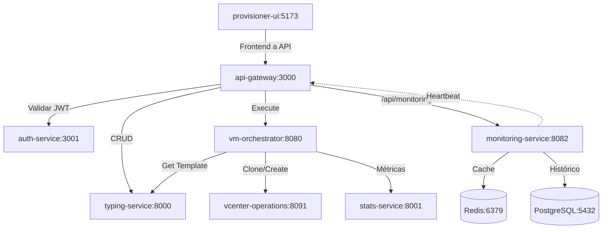

# Sistema de Monitoreo: Documentación de Diseño

> **Decisión formal:** Ver [ADR-004](./ADR-004-monitoring-architecture.md) para el registro de la decisión arquitectónica.
> **Entorno actual:** Kubernetes (los servicios usan `kubectl exec` en lugar de `docker exec`).

## 1. Matriz de Conectividad (Basada en C4)

### Diagrama de Conexiones Reales



### Matriz de Probes por Servicio

| Servicio | Probea a (Conexiones Reales) | Probea a (Monitoring) | Intervalo |
|----------|-------------------------------|---------------------|-----------|
| **api-gateway** | auth-service, typing-service, orchestrator, vcenter, stats | monitoring-service | 20s |
| **auth-service** | api-gateway, typing-service, orchestrator, vcenter, stats | monitoring-service | 20s |
| **vm-orchestrator** | typing-service, vcenter, stats | monitoring-service | 20s |
| **typing-service** | api-gateway, orchestrator | monitoring-service | 30s (sample 3) |
| **vcenter-operations** | orchestrator, stats | monitoring-service | 30s (sample 3) |
| **stats-service** | api-gateway, orchestrator | monitoring-service | 30s (sample 3) |
| **provisioner-ui** | api-gateway, auth-service | monitoring-service | 30s (sample 3) |
| **monitoring-service** | api-gateway, auth-service, typing-service, orchestrator, vcenter, stats, ui | - | 10s |

---

## 2. Endpoint de Configuración de Probes

Cada servicio debe exponer su configuración de probes:

```typescript
// GET /api/probe-config
interface ProbeConfig {
  service: string;
  interval_seconds: number;
  mode: 'full' | 'sample';
  sample_count: number;
  targets: string[];  // Lista de servicios a probe
  monitoring_url: string;
}

// Ejemplo response para typing-service:
{
  "service": "typing-service",
  "interval_seconds": 30,
  "mode": "sample",
  "sample_count": 3,
  "targets": ["api-gateway", "orchestrator"],
  "monitoring_url": "http://monitoring-service:8082"
}
```

---

## 3. Flujo de Datos de Probes

```
┌─────────────────────────────────────────────────────────────────┐
│                    FLUJO DE PROBES                              │
├─────────────────────────────────────────────────────────────────┤
│                                                                 │
│  probe-scheduler                                                │
│  ┌─────────────────────────────────────────────────────────┐    │
│  │ 1. Lee configuración (variables de entorno)          │    │
│  │ 2. Obtiene lista de targets                           │    │
│  │ 3. Si mode=sample: selecciona N aleatorios           │    │
│  │ 4. Ejecuta curl /health a cada target                 │    │
│  │ 5. Envía resultado a monitoring-service               │    │
│  └─────────────────────────────────────────────────────────┘    │
│                              │                                  │
│                              ▼                                  │
│  monitoring-service (POST /api/probe-result)                   │
│  ┌─────────────────────────────────────────────────────────┐    │
│  │ 1. Guarda en Redis (TTL 60s)                          │    │
│  │ 2. Guarda en PostgreSQL (histórico)                   │    │
│  │ 3. Actualiza matriz de conectividad                   │    │
│  │ 4. Calcula métricas agregadas                         │    │
│  └─────────────────────────────────────────────────────────┘    │
│                              │                                  │
│                              ▼                                  │
│  provisioner-ui (/monitor)                                     │
│  ┌─────────────────────────────────────────────────────────┐    │
│  │ 1. Polling GET /api/services-status (60s)            │    │
│  │ 2. GET /api/connectivity-matrix                       │    │
│  │ 3. Visualiza diagrama + cards                        │    │
│  └─────────────────────────────────────────────────────────┘    │
│                                                                 │
└─────────────────────────────────────────────────────────────────┘
```

---

## 4. Endpoints del Monitoring-Service

Según el código en `main.go`:

| Endpoint | Descripción |
|----------|-------------|
| `POST /api/probe-result` | Recibe y almacena resultados |
| `GET /api/services-status` | Retorna estado de todos los servicios |
| `GET /api/connectivity-matrix` | Matriz de conectividad |
| `GET /api/services-history` | Historial de probes |
| Redis + PostgreSQL | Hybrid storage implementado |
| Schema automático | Tables created on start |

---

## 5. URLs de Acceso

| Recurso | URL |
|---------|-----|
| UI de Monitoreo | `https://vc-ui.playground.net/monitor` |
| API de Estado | `http://monitoring-service:8082/api/services-status` |
| API de Conectividad | `http://monitoring-service:8082/api/connectivity-matrix` |

---

## 6. Principio Aplicado

> **"La matriz de conectividad define qué servicios deben probeear a cuáles."**

- Los probes siguen el flujo de tráfico real del sistema
- Sampling reduce tráfico de red mientras mantiene visibilidad
- Cada servicio conoce sus dependencias directas
- monitoring-service tiene vista completa (full mode)

---

**Documento creado:** 2026-02-06
**Última actualización:** 2026-05-20
**Versión:** 3.0 — Migrado a Kubernetes, referenciado por ADR-004
