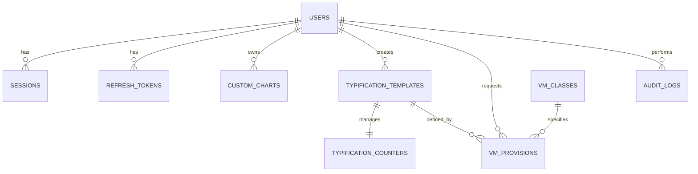

# Esquema de Base de Datos: vCenter Provisioner (PostgreSQL)

> **Última actualización:** 2026-05-21
> **Fuente de verdad:** Migraciones node-pg-migrate (`apps/auth-service/migrations/`) + init.sql (`infra/local/init.sql`)

El sistema utiliza una única base de datos PostgreSQL optimizada para el motor **TP-Haki** y el flujo de aprovisionamiento de VMs.

---

## Sistema de Migraciones

El proyecto usa **node-pg-migrate** (14 migraciones). Pipeline: `infra/local/init.sql` → usuarios mínimos + admin, luego `apps/auth-service/migrations/*.cjs` → schema completo y seeds.

| # | Archivo | Tablas |
|---|---------|--------|
| 1 | `0001_users.cjs` | users |
| 2 | `0002_vcenter_connections.cjs` | vcenter_connections, vcenter_credentials_audit |
| 3 | `0003_typification.cjs` | typification_templates, typification_counters |
| 4 | `0004_vm_classes.cjs` | vm_classes |
| 5 | `0005_vm_provisions.cjs` | vm_provisions |
| 6 | `0006_audit_logs.cjs` | audit_logs |
| 7 | `0007_sessions.cjs` | sessions |
| 8 | `0009_token_blacklist.cjs` | token_blacklist |
| 9 | `0010_refresh_tokens.cjs` | refresh_tokens |

---

## 1. Diccionario de Datos

### `users`
**PK:** `id` SERIAL. **Columnas clave:** `username` VARCHAR(50) UNIQUE, `password_hash` TEXT, `role` VARCHAR(20) DEFAULT 'operator', `created_at`, `updated_at`.
Usuarios por defecto: `admin`/`password123` (admin), `operator`/`operator123` (operator).

### `sessions`
**PK:** `id` UUID DEFAULT gen_random_uuid(). **FK:** `user_id` → users(id) ON DELETE CASCADE. **Columnas:** `expires_at`, `ip_address` VARCHAR(45), `user_agent` TEXT, `is_active` BOOLEAN DEFAULT true, `created_at`.

### `refresh_tokens`
**PK:** `refresh_token` TEXT. **FK:** `user_id` → users(id) ON DELETE CASCADE. **Columnas:** `expires_at`, `is_used` BOOLEAN DEFAULT false, `created_at`.

### `token_blacklist`
**PK:** `jti` TEXT. **Columnas:** `blacklisted_at`, `expires_at`.

### `typification_templates`
**PK:** `id` SERIAL. **Columnas clave:** `name` VARCHAR(100) UNIQUE, `description` TEXT, `prefijo1` VARCHAR(50) DEFAULT 'SRV', `prefijo2` VARCHAR(50) DEFAULT 'DEV', `seq_digits` INTEGER DEFAULT 3, `is_active` BOOLEAN DEFAULT TRUE, `edit_reason` VARCHAR(255), `created_by` FK → users(id), `created_at`, `updated_at`.
**Ejemplos:** `PROD-SRV-0001` (prefijo1=PROD, prefijo2=SRV, seq_digits=4), `DEV-DB-001` (prefijo1=DEV, prefijo2=DB, seq_digits=3).

### `typification_counters`
**PK/FK:** `template_id` → typification_templates. **Columnas:** `current_value` INTEGER DEFAULT 0, `updated_at`.

### `vm_classes`
**PK:** `id` SERIAL. **Columnas clave:** `name` VARCHAR(100) UNIQUE, `description`, `cpu_cores` INTEGER CHECK (1-256), `memory_mb` INTEGER CHECK (512-524288), `storage_gb` INTEGER CHECK (10-10000), `cpu_reservation_percent` INTEGER (0-100), `memory_reservation_percent` INTEGER (0-100), `provisioning_type` VARCHAR(10) CHECK (thin, thick), `storage_policy`, `is_locked` DEFAULT FALSE, `is_active` DEFAULT TRUE, `created_by_id` FK → users(id).

**Clases por defecto:**

| Nombre | CPU | RAM | Storage | Uso |
|:-------|:---:|:---:|:-------:|:----|
| Gold | 8 | 16GB | 500GB thick | Producción |
| Silver | 4 | 8GB | 200GB thin | Desarrollo |
| Bronze | 2 | 4GB | 50GB thin | Testing |
| Micro | 1 | 512MB | 10GB thin | Servicios pequeños |

### `vm_provisions`
**PK:** `id` SERIAL. **Columnas clave:** `vm_name` VARCHAR(255) UNIQUE, `template_id` FK → typification_templates, `requester_id` FK → users, `vcenter_datacenter` VARCHAR(100), `vcenter_cluster` VARCHAR(100), `vcenter_resource_pool` VARCHAR(100), `status` VARCHAR(20) DEFAULT 'pending', `specs` JSONB, `error_log` TEXT, `created_at`, `updated_at`.

### `custom_charts`
**PK:** `id` SERIAL. **FK:** `user_id` → users(id) ON DELETE CASCADE. **Columnas:** `name`, `chart_type` (line/bar/area/pie), `metric`, `group_by`, `timeframe` DEFAULT '7d', `filters` JSONB, `is_public` DEFAULT false, `created_at`, `updated_at`.

### `audit_logs`
**PK:** `id` SERIAL. **FK:** `user_id` → users. **Columnas:** `action` VARCHAR(100), `resource_type` VARCHAR(50), `resource_id` VARCHAR(100), `details` JSONB, `ip_address` VARCHAR(45), `created_at`.

---

## 2. Diagrama ER

---

## 3. Índices

| Tabla | Índice | Columna(s) |
|:------|:-------|:-----------|
| `users` | users_pkey / users_username_key | id / username |
| `sessions` | idx_sessions_user_id / idx_sessions_expires_at | user_id / expires_at |
| `refresh_tokens` | idx_refresh_tokens_user / idx_refresh_tokens_expires | user_id / expires_at |
| `token_blacklist` | idx_token_blacklist_expires | expires_at |
| `custom_charts` | idx_custom_charts_user | user_id |
| `vm_classes` | idx_vm_classes_active / idx_vm_classes_locked | is_active / is_locked |
| `vm_provisions` | idx_provisions_status / idx_provisions_requester | status / requester_id |
| `audit_logs` | idx_audit_logs_user / idx_audit_logs_created | user_id / created_at |

---

## 4. Scripts de Referencia

- `infra/local/init.sql` — Schema completo + datos iniciales
- `apps/typing-service/app/init_db.py` — Inicialización de DB

---

## 5. Notas de Mantenimiento

**Cambiar contraseña admin:** `UPDATE users SET password_hash = '$2b$12$...' WHERE username = 'admin';`
**Templates activos:** `SELECT * FROM typification_templates WHERE is_active = TRUE;`
**Estado provisiones:** `SELECT vm_name, status, created_at FROM vm_provisions ORDER BY created_at DESC;`
**Limpiar sesiones/tokens expirados:** `DELETE FROM sessions WHERE expires_at < NOW(); DELETE FROM token_blacklist WHERE expires_at < NOW();`

---

© 2026 Antigravity Engineering | Database Reference
