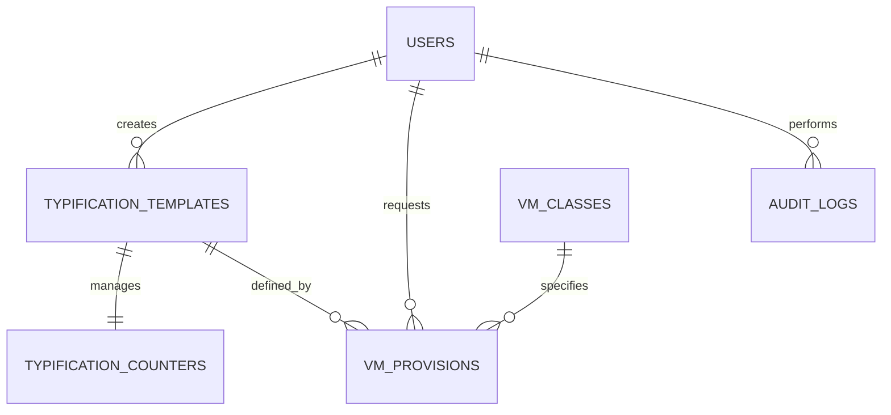

# Esquema de Base de Datos: vCenter Provisioner (PostgreSQL)

> **Última actualización:** 2026-03-18
> **Fuente de verdad:** Migraciones node-pg-migrate (`apps/auth-service/migrations/`) + init.sql (`infra/local/init.sql`)

El sistema utiliza una única base de datos PostgreSQL optimizada para el motor **TP-Haki** y el flujo de aprovisionamiento de VMs.

---

## Sistema de Migraciones

El proyecto usa **node-pg-migrate** para gestión de migraciones, siguiendo mejores prácticas de Context7.

### Flujo de ejecución

```bash
./pipeline.sh --migrate
```

El pipeline ejecuta en orden:
1. `infra/local/init.sql` - Solo usuarios mínimos (tabla users + admin)
2. `apps/auth-service/migrations/*.cjs` - Schema completo y seeds

### Archivos de migraciones

| # | Archivo | Tablas |
|---|---------|--------|
| 1 | `1773800000001_users.cjs` | users |
| 2 | `1773800000002_vcenter_connections.cjs` | vcenter_connections, vcenter_credentials_audit |
| 3 | `1773800000003_typification.cjs` | typification_templates, typification_counters |
| 4 | `1773800000004_vm_classes.cjs` | vm_classes |
| 5 | `1773800000005_vm_provisions.cjs` | vm_provisions |
| 6 | `1773800000006_audit_logs.cjs` | audit_logs |

### Características

- ✅ **Idempotentes**: Usan `CREATE TABLE IF NOT EXISTS`, pueden ejecutarse múltiples veces
- ✅ **Formato Unix timestamp**: 13 dígitos (ej: `1773800000001`)
- ✅ **Best practice**: Separación entre init.sql y migraciones

---

## 1. Diccionario de Datos

### Tabla: `users`

| Columna | Tipo | Descripción |
|:--------|:-----|:------------|
| `id` | SERIAL (PK) | Identificador único del operador |
| `username` | VARCHAR(50) UNIQUE | Nombre de usuario único |
| `password_hash` | TEXT | Hash bcrypt de la contraseña |
| `role` | VARCHAR(20) DEFAULT 'operator' | Rol (admin, operator, viewer) |
| `created_at` | TIMESTAMP WITH TIME ZONE | Fecha de creación |

**Usuarios por defecto:**
- `admin` / `password123` (rol: admin)
- `operator` / `operator123` (rol: operator)

---

### Tabla: `typification_templates`

| Columna | Tipo | Descripción |
|:--------|:-----|:------------|
| `id` | SERIAL (PK) | Identificador único |
| `name` | VARCHAR(100) UNIQUE | Nombre descriptivo |
| `description` | TEXT | Descripción de la plantilla |
| `prefijo1` | VARCHAR(50) NOT NULL DEFAULT 'SRV' | Primer segmento del nombre |
| `prefijo2` | VARCHAR(50) NOT NULL DEFAULT 'DEV' | Segundo segmento del nombre |
| `seq_digits` | INTEGER NOT NULL DEFAULT 3 | Dígitos del número secuencial |
| `is_active` | BOOLEAN DEFAULT TRUE | Si la plantilla está activa |
| `edit_reason` | VARCHAR(255) | Razón del último cambio |
| `created_by` | INTEGER REFERENCES users(id) | Usuario que creó |
| `created_at` | TIMESTAMP WITH TIME ZONE | Fecha de creación |
| `updated_at` | TIMESTAMP WITH TIME ZONE | Última modificación |

**Ejemplos:**
- `PROD-SRV-0001` (prefijo1=PROD, prefijo2=SRV, seq_digits=4)
- `DEV-DB-001` (prefijo1=DEV, prefijo2=DB, seq_digits=3)

---

### Tabla: `typification_counters`

| Columna | Tipo | Descripción |
|:--------|:-----|:------------|
| `template_id` | INTEGER (FK, PK) | Referencia a typification_templates |
| `current_value` | INTEGER DEFAULT 0 | Último número secuencial asignado |
| `updated_at` | TIMESTAMP WITH TIME ZONE | Última actualización |

---

### Tabla: `vm_classes`

| Columna | Tipo | Descripción |
|:--------|:-----|:------------|
| `id` | SERIAL (PK) | Identificador único |
| `name` | VARCHAR(100) UNIQUE | Nombre del perfil |
| `description` | VARCHAR(500) | Descripción del perfil |
| `cpu_cores` | INTEGER CHECK (1-256) | Núcleos de CPU |
| `memory_mb` | INTEGER CHECK (512-524288) | Memoria en MB |
| `storage_gb` | INTEGER CHECK (10-10000) | Almacenamiento en GB |
| `cpu_reservation_percent` | INTEGER CHECK (0-100) | % reserva CPU |
| `memory_reservation_percent` | INTEGER CHECK (0-100) | % reserva memoria |
| `provisioning_type` | VARCHAR(10) CHECK (thin, thick) | Tipo de aprovisionamiento |
| `storage_policy` | VARCHAR(100) | Política de almacenamiento |
| `is_locked` | BOOLEAN DEFAULT FALSE | Si está bloqueado |
| `is_active` | BOOLEAN DEFAULT TRUE | Si está activo |
| `created_by` | VARCHAR(100) | Usuario que creó |
| `created_at` | TIMESTAMP WITH TIME ZONE | Fecha de creación |
| `updated_at` | TIMESTAMP WITH TIME ZONE | Última modificación |

**Clases por defecto:**

| Nombre | CPU | RAM | Storage | Uso |
|:-------|:---:|:---:|:-------:|:----|
| Gold | 8 | 16GB | 500GB thick | Producción |
| Silver | 4 | 8GB | 200GB thin | Desarrollo |
| Bronze | 2 | 4GB | 50GB thin | Testing |
| Micro | 1 | 512MB | 10GB thin | Servicios pequeños |

---

### Tabla: `vm_provisions`

| Columna | Tipo | Descripción |
|:--------|:-----|:------------|
| `id` | SERIAL (PK) | Identificador único |
| `vm_name` | VARCHAR(255) UNIQUE | Nombre generado por TP-Haki |
| `template_id` | INTEGER FK | Plantilla usada |
| `requester_id` | INTEGER FK | Usuario que solicitó |
| `vcenter_datacenter` | VARCHAR(100) | Datacenter de vCenter |
| `vcenter_cluster` | VARCHAR(100) | Cluster de destino |
| `vcenter_resource_pool` | VARCHAR(100) | Resource Pool |
| `status` | VARCHAR(20) DEFAULT 'pending' | pending, in_progress, success, error, cancelled |
| `specs` | JSONB | specs CPU, RAM, Storage asignados |
| `error_log` | TEXT | Error si falló |
| `created_at` | TIMESTAMP WITH TIME ZONE | Fecha de solicitud |
| `updated_at` | TIMESTAMP WITH TIME ZONE | Última actualización |

---

### Tabla: `audit_logs`

| Columna | Tipo | Descripción |
|:--------|:-----|:------------|
| `id` | SERIAL (PK) | Identificador único |
| `user_id` | INTEGER FK | Usuario que realizó la acción |
| `action` | VARCHAR(100) NOT NULL | Acción realizada |
| `resource_type` | VARCHAR(50) | Tipo de recurso |
| `resource_id` | VARCHAR(100) | ID del recurso |
| `details` | JSONB | Detalles adicionales |
| `ip_address` | VARCHAR(45) | IP del cliente |
| `created_at` | TIMESTAMP WITH TIME ZONE | Fecha de la acción |

---

## 2. Diagrama ER (Simplificado)



---

## 3. Índices

| Tabla | Índice | Columna(s) |
|:------|:-------|:-----------|
| `vm_classes` | idx_vm_classes_active | is_active |
| `vm_classes` | idx_vm_classes_locked | is_locked |
| `vm_provisions` | idx_provisions_status | status |
| `vm_provisions` | idx_provisions_requester | requester_id |
| `audit_logs` | idx_audit_logs_user | user_id |
| `audit_logs` | idx_audit_logs_created | created_at |

---

## 4. Scripts de Referencia

| Script | Propósito |
|:-------|:----------|
| `infra/local/init.sql` | Schema completo + datos iniciales |
| `apps/typing-service/app/init_db.py` | Inicialización de DB |

---

## 5. Notas de Mantenimiento

### Cambiar contraseña de admin
```sql
UPDATE users SET password_hash = '$2b$12$...' WHERE username = 'admin';
```

### Ver templates activos
```sql
SELECT * FROM typification_templates WHERE is_active = TRUE;
```

### Ver estado de provisiones
```sql
SELECT vm_name, status, created_at FROM vm_provisions ORDER BY created_at DESC;
```

---

© 2026 Antigravity Engineering | Database Reference
